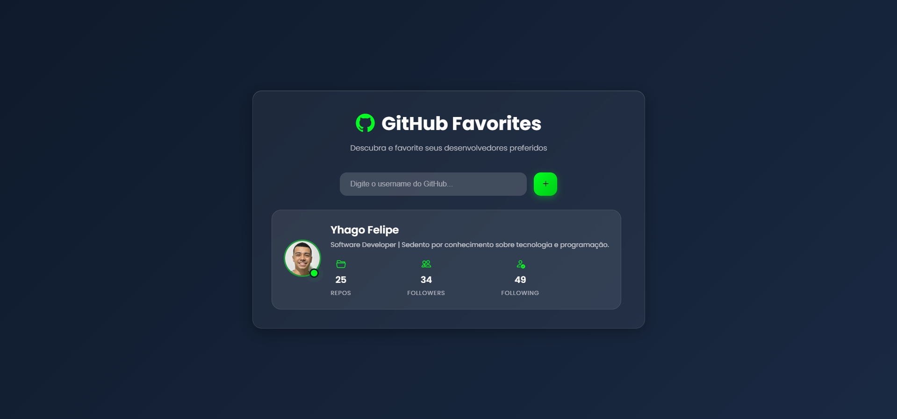

# 🌟 GitHub Favorites

<div align="center">
  
  
  
  
</div>

<div align="center">
  <h3>🚀 Desafio Rocketseat Explorer - Stage 06</h3>
  <p>Uma aplicação web para gerenciar seus desenvolvedores favoritos do GitHub</p>
</div>

---

## 📋 Sobre o Projeto

O **GitHub Favorites** é uma Single Page Application (SPA) desenvolvida como parte do desafio da Rocketseat Explorer - Stage 06. O projeto permite aos usuários pesquisar perfis de desenvolvedores no GitHub e adicioná-los a uma lista personalizada de favoritos, facilitando o acompanhamento de seus desenvolvedores preferidos.



### ✨ Funcionalidades

- 🔍 **Busca de usuários**: Pesquise qualquer perfil público do GitHub
- ⭐ **Lista de favoritos**: Adicione e remova desenvolvedores dos seus favoritos
- 💾 **Persistência de dados**: Os favoritos são salvos no localStorage do navegador
- 📱 **Design responsivo**: Interface adaptada para diferentes tamanhos de tela
- 🔄 **Integração com API**: Consome a API oficial do GitHub para buscar informações dos usuários
- ⚡ **SPA**: Navegação fluida sem recarregamento de página

---

## 🛠️ Tecnologias Utilizadas

- **JavaScript ES6+**: Lógica da aplicação, manipulação do DOM e consumo de API
- **HTML5**: Estruturação semântica da aplicação
- **CSS3**: Estilização e layout responsivo
- **GitHub API**: Integração para busca de perfis de usuários

### 📚 Conceitos Aplicados

- **Async/Await e Promises**: Requisições assíncronas à API
- **Manipulação do DOM**: Criação dinâmica de elementos
- **Try/Catch**: Tratamento de erros
- **Arrow Functions**: Sintaxe moderna do JavaScript

---

## 🚀 Como Executar o Projeto

### Pré-requisitos

- Navegador web moderno
- Editor de código (recomendado: VS Code)
- Extensão Live Server (opcional, para desenvolvimento)

### Executando

1. **Clone o repositório**
```bash
git clone https://github.com/yyhago/github-favorites-javascript.git
```

2. **Navegue até o diretório**
```bash
cd github-favorites-javascript
```

3. **Abra o projeto**
   - Opção 1: Abra o arquivo `index.html` diretamente no navegador
   - Opção 2: Use o Live Server no VS Code para um ambiente de desenvolvimento

4. **Utilize a aplicação**
   - Digite o username de um usuário do GitHub
   - Clique em "Favoritar" para adicionar à lista
   - Gerencie sua lista de favoritos

---

## 📱 Como Usar

1. **Buscar usuário**: Digite o username do GitHub na caixa de pesquisa
3. **Visualizar favoritos**: Veja a lista com informações dos usuários adicionados
4. **Remover favoritos**: Use o botão de remoção para deletar um usuário da lista

---

## 🎨 Layout

O projeto conta com um design moderno e responsivo, com:

- Interface limpa e intuitiva
- Paleta de cores profissional
- Animações suaves
- Adaptação para dispositivos móveis
- Experiência de usuário otimizada

---

## 🔗 API Utilizada

**GitHub API v3**
- Endpoint: `https://api.github.com/users/{username}`
- Documentação: [GitHub API Docs](https://docs.github.com/en/rest)

### Dados Consumidos:
- Avatar do usuário
- Nome e username
- Número de repositórios públicos
- Número de seguidores

---

## 🤝 Contribuindo

Contribuições são sempre bem-vindas! Para contribuir:

1. Faça um fork do projeto
2. Crie uma branch para sua feature (`git checkout -b feature/AmazingFeature`)
3. Commit suas mudanças (`git commit -m 'Add some AmazingFeature'`)
4. Push para a branch (`git push origin feature/AmazingFeature`)
5. Abra um Pull Request

---

## 📝 Licença

Este projeto está sob a licença MIT. Veja o arquivo [LICENSE](LICENSE) para mais detalhes.

---

## 👨‍💻 Autor

**Yhago**

- GitHub: [@yyhago](https://github.com/yyhago)

---

## 🎓 Agradecimentos

- [Rocketseat](https://rocketseat.com.br/) pela excelente didática e desafio proposto
- Comunidade de desenvolvedores que contribui constantemente com conhecimento
- GitHub pela API pública que torna projetos como este possíveis

---

<div align="center">
  <p>⭐ Se este projeto te ajudou, considere dar uma estrela!</p>
  <p>Feito com ❤️ como parte do Explorer da Rocketseat 🚀</p>
</div>
